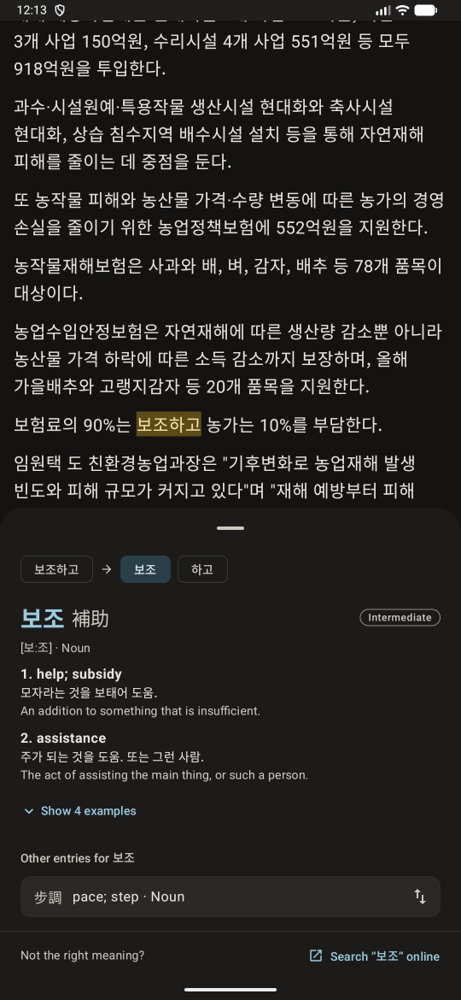
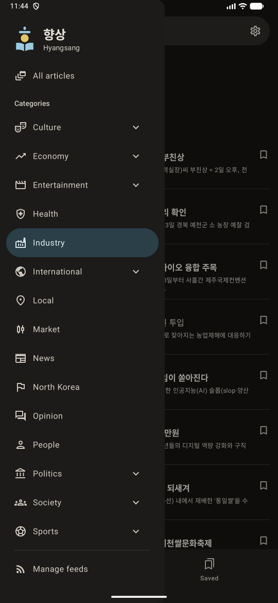

# Hyangsang (향상)

[](https://github.com/Gawkat/hyangsang/actions/workflows/tests.yml)

A reader app for Korean learners: Korean news from many categories, with tap-to-look-up dictionary
support.

## Screenshots

<table>
  <tr>
    <td></td>
    <td></td>
  </tr>
</table>

## Features

* Integrated RSS feeds from multiple sources, including:
    * Yonhap News
    * SBS News
    * BBC News 코리아
* Built-in offline dictionary with context-aware tap-to-look-up when reading
* Saved articles
* Text & layout customization
* Background sync of feeds
* English and Korean language support

## Building

The bundled dictionary isn't part of the repository, so it has to be generated before the first
build. Without it, the app builds, but fails when it opens the dictionary.

1. Clone the repository and open it in Android Studio, or use the command line with a JDK 17 or
   newer in `JAVA_HOME`. The JDK bundled with Android Studio works.
2. Generate the dictionary from the NIKL data, as described
   in [CONTRIBUTING.md](CONTRIBUTING.md#the-bundled-dictionary).
3. Build and install the app on a connected device or emulator:

   ```bash
   ./gradlew :app:installDebug
   ```

For signed release builds and running the tests, see [CONTRIBUTING.md](CONTRIBUTING.md).

## Contributing

Hyangsang is currently in early development and accepting bug reports through issues. Pull requests
for bug fixes reported through issues are always welcome. Open a
[discussion](https://github.com/Gawkat/hyangsang/discussions) before creating pull requests for new
features. See [CONTRIBUTING.md](CONTRIBUTING.md) for more details.

## Acknowledgements

* [National Institute of Korean Language's Korean-English Learners' Dictionary](https://krdict.korean.go.kr/eng/mainAction)
  for offline dictionary lookups
* [open-korean-text](https://github.com/open-korean-text/open-korean-text) for lemmatization

## License

Hyangsang is free software: you can redistribute it and/or modify it under the terms of the GNU
General Public License as published by the Free Software Foundation, either version 3 of the
License, or (at your option) any later version. See [LICENSE](LICENSE) for the full text.

The dictionary bundled with the app is not covered by this license. It is built from the National
Institute of Korean Language's Korean-English Learners' Dictionary, which is provided under the
Creative Commons Attribution-ShareAlike license (see
the [copyright terms](https://krdict.korean.go.kr/eng/kboardPolicy/copyRightTermsInfo)), and the
generated dictionary database is distributed under the same license.
